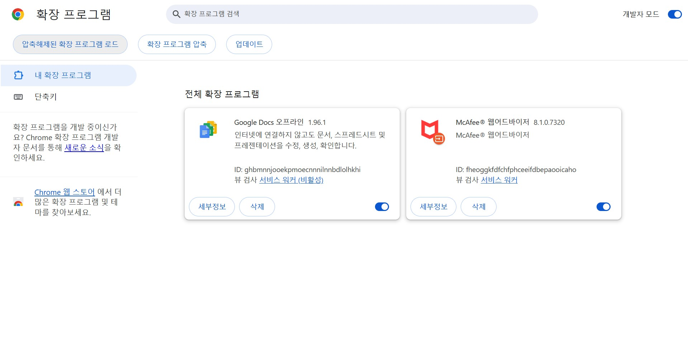

  

  

## 🎮 Project Introduction

<h1 align="center">유데미 번역 확장 프로그램</h1>

이 확장 프로그램은 Udemy 강의의 영어 자막을 실시간으로 번역하여 한글 자막을 제공하는 크롬 확장 프로그램입니다.
OpenAI 및 DeepL API를 활용하여 높은 품질의 자막을 제공합니다. 

  <a href="https://github.com/marte113/Player-On-Caption" target="_blank">🎮 GitHub_Link</a>
   

## 👨‍💻 Developers

|                                            FE                                             |
| :---------------------------------------------------------------------------------------: |
|  |
|                         [@marte113](https://github.com/marte113)                          |

## 🧰 Tech Stacks

- Node v.22.x (서버 - 레거시)
- 언어/프레임워크: `javascript(ES2020)`, `chrome_extension_manifest_v3`
- 백엔드 서버: `express`, `node-fetch` (레거시)
- 외부 API: `openai_api`, `deepl_api`
- 패키지 매니저: `npm` (레거시)
- 환경 변수 관리: `chrome.storage.local`

## 🏗️ Architecture

프로덕션 규칙: MV3 기반 메시징 파이프라인을 통하여, 파일 간 통신을 이루며 각각의 파일은 다음과 같은 컨텍스트 내부에서 동작합니다.

  

- 📁 `background` (Service Worker)
  - **역할**: 확장 프로그램의 핵심 로직 및 API 통신 허브.
  - **주요 기능**:
    - `chrome.storage`에서 API 키를 안전하게 조회.
    - OpenAI/DeepL 등 외부 번역 API 호출 및 응답 처리.
  - **연결점**: `content_script`로부터 번역 요청 메시지를 수신하고, 번역 결과를 다시 `content_script`로 전송.

- 📁 `content_script`
  - **역할**: 유데미 웹 페이지와 직접 상호작용하는 스크립트.
  - **주요 기능**:
    - 강의 페이지의 자막(대본) 텍스트 추출.
    - 번역된 자막을 화면에 표시하기 위한 DOM 조작.
    - 자막 변경 감지 및 실시간 업데이트.
  - **연결점**: 추출한 텍스트를 `background`로 보내 번역을 요청하고, `popup`의 UI 이벤트(번역 시작)에 따라 동작.

- 📁 `extension_page` (Popup & Options)
  - **역할**: 사용자 인터페이스(UI) 및 설정 관리.
  - **주요 기능**:
    - **(popup.js)**: '자동 번역', '내 번역 사용' 등 기능 실행 트리거.
    - **(options.js)**: 사용자가 API 키를 입력하고 저장하는 설정 페이지 제공.
  - **연결점**: `popup`에서 사용자가 번역 시작 버튼을 누르면 `content_script`로 메시지를 보내 작업을 개시. `options`에서는 `chrome.storage`에 API 키를 저장하여 `background`가 사용하도록 함.

> 우리 앱은 chrome 브라우저 사용을 권장하며, 크로미움 기반 브라우저에서 동작합니다.

## 💡Usage

#### 🏠 확장 프로그램 등록 - 1 🏠

&nbsp;#GitHub 주소에서 파일 다운로드 or git clone 수행 후, 크롬 브라우저의 "확장 프로그램 관리" 탭에서, 우측 상단의 "개발자 모드"를 켜줍니다. 그 후, "압축해제된 확장 프로그램 로드"를 클릭해줍니다.

<table>
  <tr>
    <td width="75%" valign="top">
      
    </td>
    
  </tr>
  
</table>

#### 📊 확장 프로그램 등록 - 2 📊

&nbsp; "압축해제된 확장 프로그램 로드"를 클릭 한 후, 다운 받은 폴더에서 subtitle 폴더를 선택해줍니다.
&nbsp;

<table>
  <tr>
    <td width="75%" valign="top">
     
    </td>
   
  </tr>
  
</table>

#### 📋 확장 프로그램 등록 - 3 📋

&nbsp; AI 번역 기능(자동 모드)을 사용하기 위해서는 OpenAI API 키가 필요하며, 크레딧이 충전되어 있어야 합니다. 5$ 가량의 크레딧만 있더라도 넉넉한 강의 청취가 가능합니다.

**API 키 발급 방법:**

1. [OpenAI API Keys 페이지](https://platform.openai.com/settings/organization/api-keys)에서 "Create new secret key" 클릭
2. 권한 설정 시 **Restricted** 선택 (보안 권장)
3. 최소 필수 권한:
   - **Responses API: Write** (필수 - 자막 번역 응답에 사용)
   - **Models: Read** (권장 - 모델 정보 확인용)

> 💡 사용 모델에 따른 key권한 업데이트를 원치 않을 경우 `All` 권한을 추천합니다.

**API 키 등록:**

- 발급받은 API 키는 확장 프로그램의 옵션 페이지에서 입력합니다.
- API 키는 `chrome.storage.local`에 안전하게 저장되며 본 확장 프로그램은 API키를 수집하지 않습니다. 또한, 이 API키는 백그라운드 스크립트에서만 접근 가능하여 웹 페이지에 노출되지 않습니다.

<table>
  <tr>
    <td width="40%" valign="top">
      
    </td>
    <td width="60%" valign="top">
      
    </td>
  </tr>
  
</table>

#### 🙋 확장 프로그램 등록 - 4 🙋

&nbsp; 가장 첫 번째 입력 란에 "https://platform.openai.com/settings/organization/api-keys" 에서 발급 받은 API키를 입력 합니다.

<table>
  <tr>
    <td width="75%" valign="top">
      
    </td>
   
  </tr>
  
</table>

#### 🗨️ 확장 프로그램 실행 - 5 🗨️

&nbsp;#확장 프로그램의 실행에서 필요한 세팅은 다음과 같습니다. 

1. 강의 페이지 상에서, 플레이어 재생 바 -> "자막" -> "자막 설정" -> "동영상 아래 표시" 클릭 
2. 확장 프로그램 실행 후 Auto Translation 클릭

<table>
  <tr>
    <td width="75%" valign="top">
      
    </td>
  </tr>
  
</table>
<table>
  <tr>
    <td width="75%" valign="top">
      
    </td>
   
  </tr>
  
</table>

#### 🗓️ 확장 프로그램 실행 - 6 🗓️

&nbsp; #참고 동영상

<table>
  <tr>
    <td width="75%" valign="top">
     <video width="100%" controls>
  <source src="https://raw.githubusercontent.com/marte113/Player-On-Caption/main/subtitle/images/app_test.webm" type="video/webm">
  브라우저가 video 태그를 지원하지 않습니다.
</video>
    </td>
  
  </tr>
  
</table>

#### 📋 텍스트 모드 📋

>#텍스트 모드의 경우 다음과 같은 형태로 텍스트 파일을 준비해주어야 합니다. 
*개인적인 견해로 가장 정확하고 반복적인 번역은 gemini 2.5 pro가 좋았습니다. 
*gemini 2.5 pro에서 "새 GEM"을 등록하고, 해당 GEM에 prompt.txt 파일의 프롬프트를 입력하세요.

텍스트 준비 GPT 모델 링크 - [GPT 모델 링크](https://chatgpt.com/g/g-68e63546622c81918030765184a2bc12-yudemi-beonyeog-gpt)

<table>
  <tr>
    <td width="75%" valign="top">
      
    </td>
    
  </tr>
  
</table>

<table>
  <tr>
    <td width="75%" valign="top">
      
    </td>
    
  </tr>
  
</table>

&nbsp;AI를 통해 대본 번역을 텍스트로 준비한 후, "Use My Translation"을 클릭 합니다.

<table>
  <tr>
    <td width="75%" valign="top">
      
    </td>
   
  </tr>
  
  
</table>

<table>
  <tr>
    <td width="75%" valign="top">
      
    </td>
   
  </tr>
  
  
</table>
영상과 일치하는 번역 파일을 선택합니다.
####

>\*\*현재 GPT5-nano 버전 리팩토링 중에 있습니다. GPT5-nano api의 경우,
RTM(분당 요청 수 - 5000건), TPM(분당 토큰 수 - 5,000,000)으로 강의 대본의 경우, 모든 청크 단위를 병렬 요청하여 "자동 모드"의 보다 쾌적한 번역 세팅이 가능해졌습니다.
