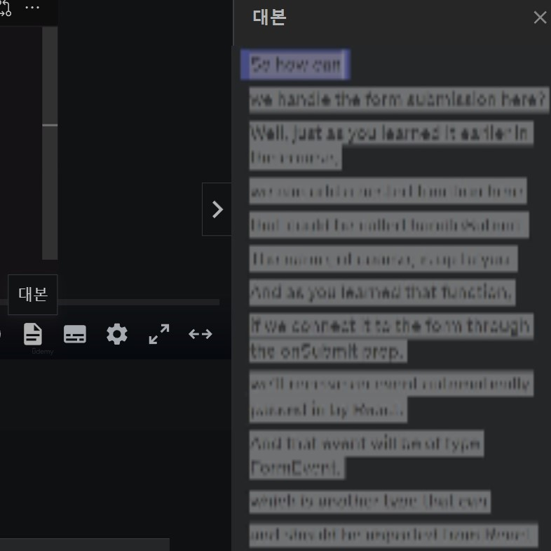
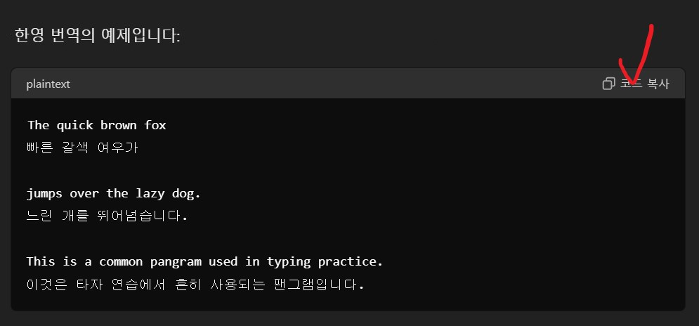
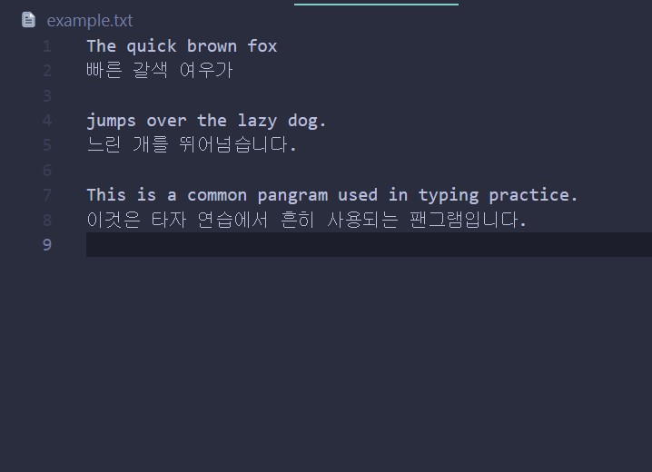
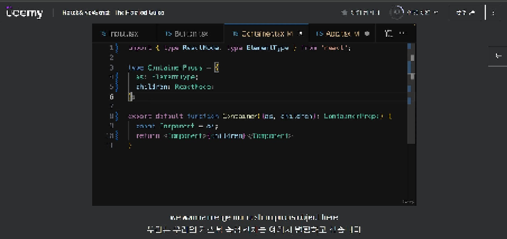

# 유데미 한글 자막 크롬 확장 프로그램

이 확장 프로그램은 Chrome 브라우저에서 작동합니다. 

**배포의 목적이 있는 프로그램이 아니기 때문에, git주소가 아닌 zip파일로 제공하게 되었습니다.

## 사용법

1. **유데미 강의 사이트에서 작동**: 이 확장 프로그램은 유데미 강의 사이트에서 한정적으로 작동합니다.
2. **번역 파일 준비**: 영어 대본과 번역이 담긴 txt 파일이 필요합니다. txt 파일의 작성 양식은 함께 첨부된 [example.txt](example.txt) 파일을 참고하세요.
3. **강의 페이지 접속**: 듣고자 하는 강의 페이지로 이동합니다.
4. **자막 설정**: 동영상 아래 자막 설정을 영어 자막으로 설정합니다.
5. **확장 프로그램 실행**: 확장 프로그램을 실행하고 번역 파일을 첨부합니다.
6. **자막 출력**: 영문 자막과 한글 자막이 함께 출력됩니다.

## 스크린샷

아래는 확장 프로그램 사용 예시 스크린샷입니다:

## 번역 파일 작성 예시

 [example.txt](example.txt)를 참고하세요.

## 설치 및 설정

1. 크롬 브라우저에서 확장 프로그램을 로드합니다.
2. 개발자 모드로 전환하고 "압축해제된 확장 프로그램을 로드"를 클릭합니다.
3. 이 프로젝트 폴더를 선택합니다.
4. 확장 프로그램이 크롬에 추가됩니다.

이 확장 프로그램을 통해 유데미 강의를 더욱 효과적으로 학습하세요!
